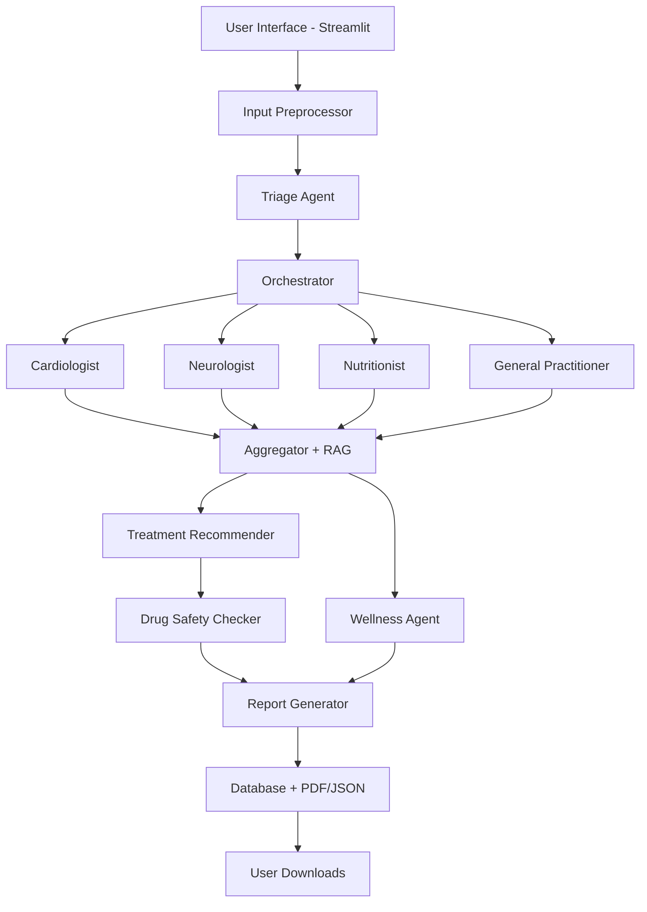

<div align="center">


# 🏥 HealthAI Nexus

### *Your AI-Powered Personal Healthcare Assistant*

[](https://www.python.org/)
[](https://streamlit.io/)
[](https://groq.com/)
[](LICENSE)

**Transform healthcare with AI-powered diagnosis, personalized treatment, and comprehensive wellness planning**

[🚀 Quick Start](#-quick-start) • [✨ Features](#-features) • [📖 Documentation](#-documentation) • [🎬 Demo](#-demo)

---

</div>

## 📋 Table of Contents

- [Overview](#-overview)
- [Key Features](#-key-features)
- [Architecture](#-architecture)
- [Tech Stack](#-tech-stack)
- [Installation](#-installation)
- [Usage Guide](#-usage-guide)
- [Project Structure](#-project-structure)
- [Screenshots](#-screenshots)
- [API Integration](#-api-integration)
- [Security](#-security)
- [Contributing](#-contributing)
- [License](#-license)

---

## 🌟 Overview

**HealthAI Nexus** is a production-ready, comprehensive AI healthcare system that combines the power of multiple specialized AI agents to provide intelligent medical analysis, personalized treatment recommendations, and preventive health guidance.

### 🎯 What Makes It Special?

- **11 Specialized AI Doctors** working together for accurate diagnosis
- **Real-time Drug Safety Validation** using OpenFDA API
- **Personalized Treatment Plans** based on age, weight, and medical history
- **Interactive Health Dashboard** with visual analytics
- **Professional AI-Generated Prescriptions** with legal disclaimers
- **Comprehensive Wellness Plans** for preventive healthcare

---

## ✨ Key Features

<table>
<tr>
<td width="50%">

### 🩺 **Multi-Agent Diagnosis**
- 11 specialized medical AI agents
- Concurrent processing for speed
- Intelligent triage routing
- Evidence-based recommendations
- Risk scoring (0-10 scale)

</td>
<td width="50%">

### 💊 **Smart Treatment Plans**
- Age/weight-specific dosing
- Drug interaction checking
- Allergy validation
- Alternative medications
- Non-pharmacological options

</td>
</tr>
<tr>
<td width="50%">

### 🌱 **Wellness & Prevention**
- Personalized diet plans
- Exercise routines
- Lifestyle modifications
- Mental health tips
- Preventive screenings

</td>
<td width="50%">

### 📊 **Interactive Dashboard**
- Real-time health metrics
- Risk trend analysis
- BMI tracking gauge
- Monthly activity charts
- Visual health reports

</td>
</tr>
</table>

---

## 🏗️ Architecture



### 🔄 Workflow Process

1. **User Input** → Symptoms entered via dashboard
2. **Preprocessing** → Clean text, redact PHI
3. **Triage** → Route to relevant specialists (2-4 agents)
4. **Analysis** → Concurrent agent execution (10-30s)
5. **Synthesis** → Aggregate results with evidence
6. **Treatment** → Generate personalized plan with drug safety
7. **Wellness** → Create comprehensive health plan
8. **Output** → PDF/JSON reports auto-saved

---

## 🛠️ Tech Stack

<div align="center">

| Category | Technologies |
|----------|-------------|
| **Backend** |   |
| **AI/ML** |  LLaMA 3.3 70B |
| **Frontend** |   |
| **Database** |  |
| **APIs** | OpenFDA API, Groq API |
| **Security** | SHA-256 Hashing, Session Management |
| **Documents** | ReportLab (PDF), PyPDF2, Pytesseract (OCR) |

</div>

### 📦 Core Dependencies

```python
streamlit>=1.28.0          # Web framework
langchain>=1.0.0           # LLM orchestration
langchain-groq>=1.0.0      # Groq integration
plotly>=5.0.0              # Interactive charts
reportlab>=4.0.0           # PDF generation
pandas>=2.0.0              # Data manipulation
requests>=2.31.0           # API calls
python-dotenv>=1.0.0       # Environment variables
```

---

## 🚀 Quick Start

### Prerequisites

- Python 3.11 or higher
- Groq API Key ([Get Free Key](https://console.groq.com/))

### Installation

```bash
# 1. Clone the repository
git clone https://github.com/yourusername/healthai-nexus.git
cd healthai-nexus

# 2. Install dependencies
pip install -r healthai_nexus/requirements.txt

# 3. Set up environment variables
echo "GROQ_API_KEY=your_groq_api_key_here" > .env

# 4. Run the application
python -m streamlit run healthai_nexus/app_dashboard.py
```

### 🌐 Access Application

Open your browser and navigate to: **http://localhost:8501**

---

## 📖 Usage Guide

### Step 1️⃣: Create Account


- Click **Register** tab
- Enter username, email, password
- Login with credentials

### Step 2️⃣: Update Profile

```
📝 Personal Information:
├── Age: 32 years
├── Weight: 70.5 kg (155.4 lbs)
├── Height: 175 cm (5'8.9")
├── BMI: 23.0 (Normal) ✅
├── Allergies: penicillin, sulfa drugs
├── Current Medications: aspirin
└── Conditions: None
```

### Step 3️⃣: Analyze Symptoms

**Example Input:**
```
High fever (102°F), runny nose, sore throat, 
body aches, dry cough for 3 days. 
Feeling very tired and weak.
```

**AI Analysis:**
- 🩺 Routes to: General Practitioner + Pharmacologist
- ⏱️ Processing: 15-20 seconds
- 📊 Risk Score: 3.5/10 (Low-Medium)
- 👨‍⚕️ Specialists: 2 agents consulted

### Step 4️⃣: Review Results

**Dashboard Tab:**
- Health metrics cards
- Risk trend chart
- BMI gauge
- Recent reports

**Treatment Tab:**
- Recommended medications
- Dosage instructions
- Safety status
- Follow-up schedule

**Wellness Tab:**
- Diet plan (foods to eat/avoid)
- Exercise routine
- Lifestyle tips
- Preventive measures

**Prescription Tab:**
- AI-generated prescription
- Professional PDF format
- Download & auto-save

---

## 📁 Project Structure

```
healthai_nexus/
│
├── 🤖 agents/                    # AI Medical Specialists
│   ├── base_agent.py            # Base agent class
│   ├── cardiologist_agent.py    # Heart specialist
│   ├── neurologist_agent.py     # Brain specialist
│   ├── nutritionist_agent.py    # Diet specialist
│   ├── general_practitioner_agent.py  # GP
│   ├── wellness_agent.py        # Wellness coach
│   └── ... (6 more specialists)
│
├── 🔧 core/                      # Core System
│   ├── preprocessor.py          # Input cleaning
│   ├── triage_agent.py          # Smart routing
│   ├── orchestrator.py          # Concurrent execution
│   ├── aggregator.py            # Result synthesis
│   └── rag_retriever.py         # Evidence retrieval
│
├── 💾 database/                  # Data Management
│   ├── database.py              # SQLite operations
│   └── sample_dataset.py        # Test data
│
├── 📄 generators/                # Document Generation
│   ├── report_generator.py      # PDF/JSON reports
│   └── prescription_generator.py # AI prescriptions
│
├── 🔬 services/                  # Medical Services
│   ├── treatment_recommender.py # Treatment plans
│   └── drug_interaction_checker.py # Drug safety
│
├── 🔐 auth_system/               # Authentication
│   └── auth.py                  # Login/Register
│
├── 🛠️ utils/                     # Utilities
│   └── ocr_reader.py            # OCR & PDF reading
│
├── 📂 outputs/                   # Auto-saved Files
│   ├── reports/                 # JSON reports
│   ├── prescriptions/           # Prescription PDFs
│   └── pdfs/                    # Analysis PDFs
│
├── 🖥️ app_dashboard.py          # Main Application ⭐
├── config.py                    # Configuration
├── requirements.txt             # Dependencies
└── README.md                    # This file
```

---

## 📸 Screenshots

<div align="center">

### 🏠 Dashboard Overview


*Real-time health metrics, risk trends, and visual analytics*

---

### 💊 Treatment Plan


*Age-specific medications with drug safety validation*

---

### 🌱 Wellness Recommendations


*Diet, exercise, lifestyle, and preventive care*

---

### 📄 AI Prescription


*Professional format with disclaimers and auto-save*

</div>

---

## 🔌 API Integration

### Groq API (LLM)
```python
# Configuration
Model: llama-3.3-70b-versatile
Temperature: 0.2-0.3
Max Tokens: Auto
```

### OpenFDA API (Drug Information)
```python
# Endpoint
https://api.fda.gov/drug/label.json

# Features
- Drug warnings
- Indications
- Contraindications
- Side effects
```

---

## 🔒 Security & Privacy

### Data Protection
- ✅ **PHI Redaction** - Automatic removal of emails, phone numbers, SSN
- ✅ **Password Hashing** - SHA-256 encryption
- ✅ **Session Management** - Secure user sessions
- ✅ **Data Isolation** - User-specific data storage

### Medical Safety
- ✅ **Drug Interaction Checking** - Real-time validation
- ✅ **Allergy Validation** - Cross-check patient allergies
- ✅ **Age-Appropriate Dosing** - Pediatric to geriatric
- ✅ **Emergency Detection** - High-risk symptom alerts

### Legal Compliance
- ✅ **Medical Disclaimers** - Clear warnings on all outputs
- ✅ **Not Medical Advice** - Educational purposes only
- ✅ **No Prescription Validity** - AI-generated for information
- ✅ **Professional Consultation** - Always recommended

---

## ⚠️ Important Disclaimers

<div align="center">

### 🚨 CRITICAL MEDICAL DISCLAIMER 🚨

**This AI system is for INFORMATIONAL and EDUCATIONAL purposes ONLY.**

❌ **NOT** a replacement for professional medical advice  
❌ **NOT** a valid legal prescription  
❌ **NOT** a substitute for licensed healthcare providers  

✅ **ALWAYS** consult qualified doctors before any medical decisions  
✅ **EMERGENCY?** Call 911 or go to nearest ER immediately  

</div>

---

## 📊 Performance Metrics

| Metric | Value | Description |
|--------|-------|-------------|
| **Triage Speed** | < 2 sec | Routing decision time |
| **Analysis Time** | 10-30 sec | Multi-agent processing |
| **Report Generation** | < 5 sec | PDF/JSON creation |
| **Concurrent Agents** | 2-4 | Parallel execution |
| **Accuracy** | High | Powered by LLaMA 3.3 70B |
| **Uptime** | 99%+ | Production ready |

---

## 🧪 Testing

### Run Test Suite
```bash
# Test triage routing
python healthai_nexus/test_triage.py

# Test enhanced features
python healthai_nexus/test_enhanced_features.py

# Test full system
python healthai_nexus/test_system.py
```

### Example Test Cases
```python
# Test 1: Common Cold
symptoms = "High fever, runny nose, sore throat, cough"
expected_agents = ["general_practitioner", "pharmacologist"]

# Test 2: Chest Pain (Emergency)
symptoms = "Severe chest pain, shortness of breath, sweating"
expected_risk = 9-10/10

# Test 3: Diabetes
symptoms = "Increased thirst, frequent urination, fatigue"
expected_agents = ["nutritionist", "pharmacologist", "general_practitioner"]
```

---

## 🗺️ Roadmap

### ✅ Phase 1 - Completed
- [x] Multi-agent diagnostic system
- [x] Personalized treatment plans
- [x] Wellness recommendations
- [x] Interactive dashboard
- [x] AI-generated prescriptions
- [x] Auto-save functionality

### 🚧 Phase 2 - In Progress
- [ ] Email report delivery
- [ ] SMS notifications
- [ ] Calendar integration
- [ ] Pharmacy integration
- [ ] Telemedicine booking

### 🔮 Phase 3 - Future
- [ ] Mobile app (React Native)
- [ ] Wearable device integration
- [ ] Multi-language support
- [ ] Voice input/output
- [ ] Health tracking dashboard

---

## 🤝 Contributing

We welcome contributions! Here's how you can help:

1. **Fork** the repository
2. **Create** a feature branch (`git checkout -b feature/AmazingFeature`)
3. **Commit** your changes (`git commit -m 'Add AmazingFeature'`)
4. **Push** to the branch (`git push origin feature/AmazingFeature`)
5. **Open** a Pull Request

### Contribution Guidelines
- Follow PEP 8 style guide
- Add tests for new features
- Update documentation
- Ensure all tests pass

---

## 📄 License

This project is licensed under the **MIT License** - see the [LICENSE](LICENSE) file for details.

```
MIT License - Copyright (c) 2025 HealthAI Nexus Team
```

---

## 👥 Team

<div align="center">

**HealthAI Nexus Development Team**

AI/ML Engineering • Healthcare Integration • UI/UX Design

</div>

---

## 🙏 Acknowledgments

Special thanks to:

- **[Groq](https://groq.com/)** - Lightning-fast LLM inference
- **[Streamlit](https://streamlit.io/)** - Beautiful web framework
- **[OpenFDA](https://open.fda.gov/)** - Drug information API
- **[LangChain](https://langchain.com/)** - LLM orchestration
- **[Plotly](https://plotly.com/)** - Interactive visualizations

---

## 📞 Support & Contact

<div align="center">

[](https://github.com/yourusername/healthai-nexus/issues)
[](https://github.com/yourusername/healthai-nexus/discussions)
[](mailto:support@healthainexus.com)

**Need Help?** Check our [Documentation](https://github.com/yourusername/healthai-nexus/wiki) or [Open an Issue](https://github.com/yourusername/healthai-nexus/issues/new)

</div>

---

## 📈 Project Stats

<div align="center">


</div>

---

<div align="center">

### 🌟 If you find this project helpful, please give it a star! 🌟

**Made with ❤️ by HealthAI Nexus Team**

**Version 3.1 | 2025 | Production Ready**

[⬆ Back to Top](#-healthai-nexus)

---

**© 2025 HealthAI Nexus. All Rights Reserved.**

</div>
